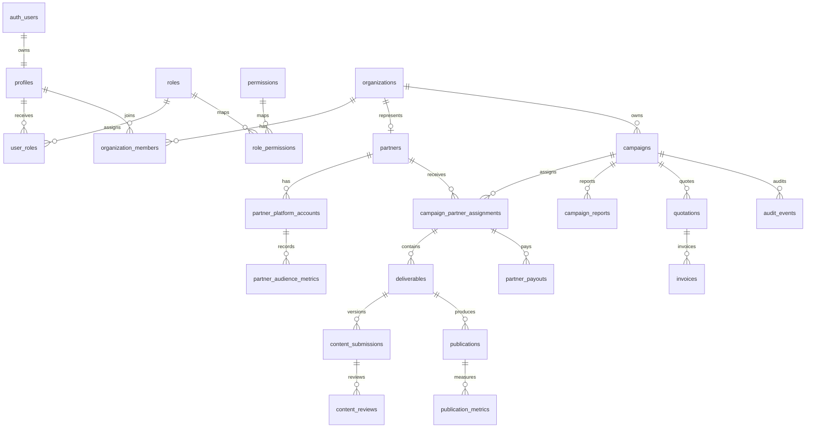

# ERD

> **Phase B0 transition notice (2026-09-02):** This diagram is the current Supabase-era model. The future identity edge is `buzzerhood.users -> buzzerhood.profiles` while profile UUIDs and every downstream FK are preserved. See `docs/AUTH_ARCHITECTURE.md`.

Foreign keys use UUIDs. Tenant root is `organizations`; active `organization_members` controls tenant access. Global system RBAC is separate from tenant membership.
