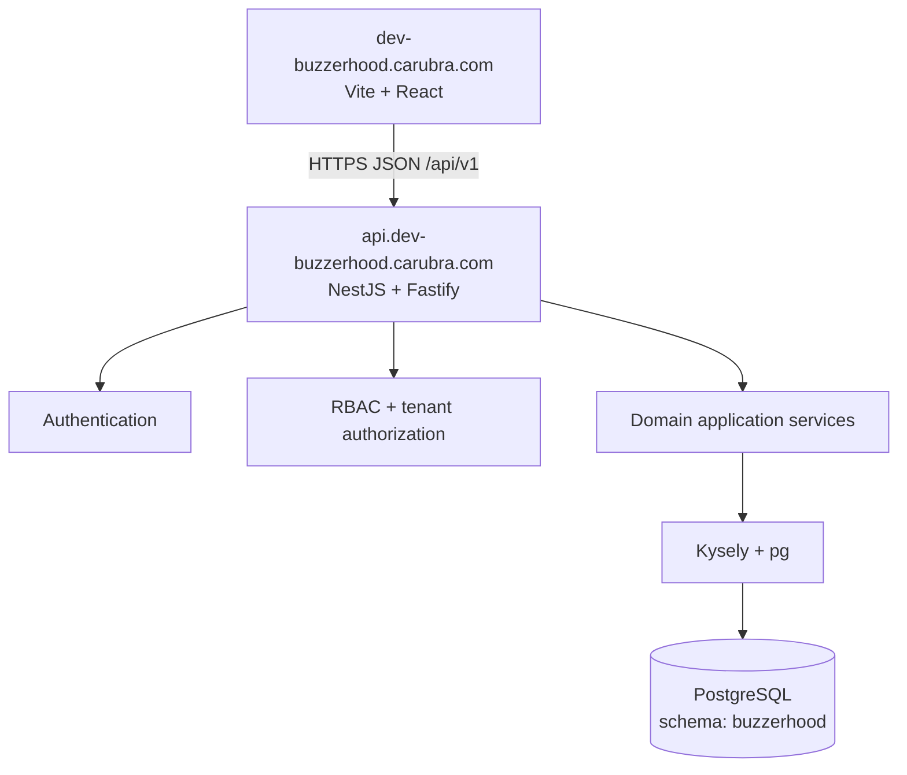
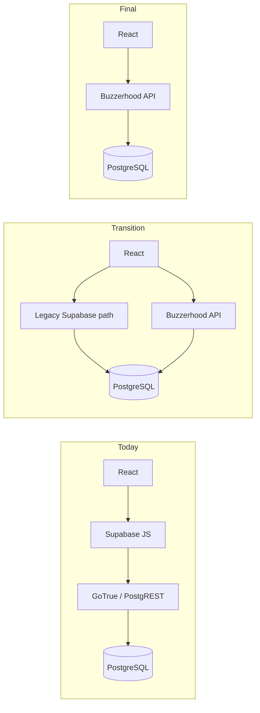
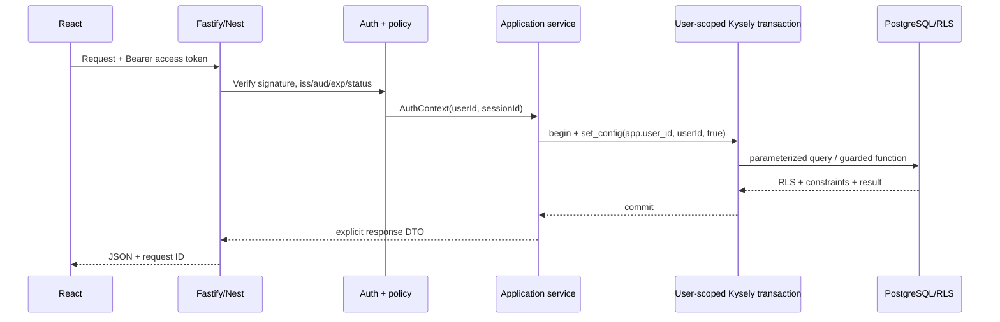

# Buzzerhood Backend Architecture

## B1 implemented state (2026-09-02)

`backend/` implements NestJS 11 + Fastify with Auth and health modules, Kysely
over a bounded `pg` pool, strict TypeScript/Zod boundaries, Pino-compatible JSON
request logging, request IDs, redaction, throttling and optional OpenAPI. The
process owns and closes its pool; SQL migrations remain the schema source of
truth. Organization, Partner, Network, Admin Partner, and Campaign workflow HTTP APIs are implemented through B3.

## Status

Phase B0 architecture decision. This document defines the target and transition; it does not authorize backend implementation, database migration, or production change.

## Context and goals

Buzzerhood is a multi-tenant Campaign & Distribution Operating System. PostgreSQL schema `buzzerhood`, its 124 imported network partners, identity references, RBAC, organizations, partner operations, campaign state machine, content versions, reviews, publications, metric snapshots, and history are retained. The change is the application security boundary: the browser will no longer access GoTrue/PostgREST business APIs directly.

Non-functional priorities are tenant isolation, data preservation, auditable workflow transitions, low operational complexity, safe incremental cutover, and an API that can be tested independently of the shared Supabase stack.

## Target system context



There is no browser-to-PostgreSQL or browser-to-PostgREST business path in the final architecture.

## Transition



This is a strangler migration at the frontend data-layer boundary. UI components continue using TanStack Query; domain query/mutation functions change transport one vertical slice at a time.

## Runtime and repository decision

- Node.js + strict TypeScript.
- NestJS with `@nestjs/platform-fastify`.
- Kysely + `pg`; SQL migrations remain schema authority. Prisma is not introduced.
- Zod validates external inputs and configuration. API schemas must not be raw database row schemas.
- Pino-compatible JSON logging with request IDs.
- OpenAPI generated from the running NestJS contract and reviewed in CI.
- Docker image deployed independently from the shared Supabase Compose project.

Initial layout:

```text
dev-buzzerhood.carubra.com/
├── src/                   existing React application
├── backend/
│   ├── src/
│   ├── test/
│   ├── package.json
│   ├── tsconfig.json
│   └── Dockerfile
├── database/
├── docs/
└── package.json
```

B1 adds `backend/` without moving the React app or forcing a workspace conversion. A root workspace may be evaluated after B4 only if shared commands/type packages provide demonstrated value.

## Module boundaries

| Module | Responsibility | Does not own |
|---|---|---|
| `config` | Typed backend configuration and secret presence | Secret values in source |
| `health` | `/health`, `/ready` | Detailed infrastructure disclosure |
| `database` | Pool, Kysely types, migrations adapter, user/service transactions | HTTP authorization decisions |
| `auth` | Users, passwords, access JWTs, refresh rotation/revocation, activation/reset ports | Organization/partner permissions in tokens |
| `identity` | Profile projection and profile edits | Password hashes |
| `authorization` | Permission loading, membership policy helpers, guards | Business state transitions |
| `organizations` | Organizations, active memberships, workspaces | Global system role administration |
| `partners` | Directory, applications, claims, memberships, platforms, metrics, rates | Campaign assignments |
| `campaigns` | Brief and campaign state machine | Content version internals |
| `assignments` | Partner invitation and response | Partner ownership approval |
| `deliverables` | Deliverable planning and status | Binary storage implementation |
| `content` | Insert-only submissions and reviews | Publication verification |
| `publications` | Publication proof, verification, metric snapshots | Reporting aggregates |
| `admin` | Explicit privileged use cases and DTOs | Generic table CRUD |
| `audit` | Security and operational audit adapter | Secret/token logging |
| `mail` | Provider-neutral verification/reset messages | Provider choice in B0 |

Reporting, billing, notification, and storage adapters are B6/later modules and are not scaffolded prematurely.

## Request flow



Route guards authenticate and reject obvious policy violations. Application services repeat resource membership/invariant checks and select explicit DTO fields. PostgreSQL constraints and adapted RLS provide defense-in-depth.

## Database strategy

- Preserve all deployed `0001`-`0017` migrations unchanged; continue at `0018+`.
- Generate backend-only Kysely types from a disposable database with all migrations applied.
- Use repositories/data mappers around Kysely queries where they clarify domain boundaries; avoid a generic repository abstraction.
- Use parameterized Kysely expressions. Raw SQL is limited to PostgreSQL features such as transaction-local context and is parameterized.
- Keep concurrency/state invariants in PostgreSQL when already encoded well: claim ownership locking, campaign transition validation, advisory-locked content version allocation, coupled review/publication state, and immutable snapshots/history.
- Move HTTP policy, input validation, response privacy, error mapping, orchestration, and external integrations to application services.

## Authentication and authorization

Custom identity uses `buzzerhood.users`, separate `buzzerhood.profiles`, and hashed rotating refresh sessions. Access JWTs are short-lived and contain minimal identity/session claims. Detailed decisions are in `AUTH_ARCHITECTURE.md`.

Authorization composes:

1. authenticated active user/session;
2. permission lookup through existing `roles`, `permissions`, `role_permissions`, `user_roles`;
3. active `organization_members` or `partner_members` scope for the resource;
4. application workflow invariants;
5. transaction-local database context and RLS defense-in-depth.

Permissions and memberships are loaded per request or through short, safely invalidated server cache later. They are not embedded as authoritative long-lived JWT claims.

## API conventions

- Base path `/api/v1`; nouns for resources and explicit action subresources only for workflow commands.
- Cursor pagination for growing lists; conservative bounded limits. Offset may be used only for small reference lists.
- ISO 8601 UTC timestamps; ISO 4217 uppercase currency codes; UUIDs as opaque identifiers.
- Successful responses return the resource or list plus pagination metadata, without a universal nested `data.data` envelope.
- Errors use `{ "error": { "code", "message", "details?", "requestId" } }`; details never contain SQL or stack traces.
- Mutation idempotency is required for retry-sensitive create/transition endpoints where duplicate execution has business impact.

## Resilience and observability

- Stateless API replicas; refresh state is in PostgreSQL.
- Bounded DB pool, query/request timeouts, graceful shutdown, and readiness failure when the database is unavailable.
- No Redis, queue, service mesh, Kafka, or microservices in B1-B5.
- Structured logs: request ID, route template, method, status, duration, user/session identifiers where appropriate, never credentials/tokens/body secrets.
- Initial metrics: request rate/errors/duration, DB pool saturation/query errors, auth outcomes, refresh replay, and workflow conflicts.
- External mail/storage adapters receive explicit timeouts and retry/idempotency design only when introduced.

## Deployment architecture

`api.dev-buzzerhood.carubra.com` is preferred over a path-only API because it decouples static frontend hosting and backend releases. The refresh cookie is host-only for the API; frontend sends credentialed requests to an allowlisted origin. This requires precise CORS and CSRF controls but avoids sharing cookies with the marketing origin. `/api` on the same origin remains a valid fallback if infrastructure simplicity outweighs independent routing.

The API has its own Compose/deployment unit and least-privilege DB role. It is not added to the Supabase Compose project. See `BACKEND_DEPLOYMENT_PLAN.md`.

## Decisions deferred

- Transactional email provider, object-storage provider, billing/report implementation, and notification transport.
- Any shared contract package/workspace conversion.
- Asymmetric key custody implementation details until deployment capabilities are confirmed; the algorithm decision is in `AUTH_ARCHITECTURE.md`.

These are not blockers for B1 foundation and auth.

## B2 implementation

The independent Nest application now has domain modules for `workspaces`, `organizations`, `network`, `partner-onboarding`, `partners`, and `admin-partners`. Protected queries execute through `withUserContext`, while atomic organization creation, application review, and claim decisions remain schema-qualified database functions. There is no generic RPC endpoint.

Active memberships are the only workspace source. Pending applications and claims are intentionally excluded. Public, Partner-workspace, and Admin Partner responses are separate purpose-specific shapes. B2 uses page/limit pagination for the bounded Network and admin reference lists.

## B3 implementation

The `campaigns` module supplies separate Client, Internal, and Partner controllers/services over the existing Campaign Engine. Every protected database operation uses transaction-local `app.user_id`; route guards are only the first layer, with active Organization/Partner membership, effective permissions, RLS, and workflow functions providing defense in depth.

Migration `0018` adapts Campaign functions from shared Supabase identity to `buzzerhood.current_user_id()`, adds Backend-role RLS policies and narrow grants, preserves advisory-locked version allocation, and tightens review/publication coupling. It is additive and retains migrations `0001`-`0017` and all existing rows.

Response mapping is purpose-specific: Client, Partner, and Internal DTOs are not raw row serializers. Campaign total budgets, procurement notes, rate snapshots, unrelated Partner assignments, review verification notes, and actor identifiers are exposed only where the use case explicitly permits them.

Production runs dark as independent image `buzzerhood-api:b3` on loopback port 3100 with a read-only filesystem and least-privilege `buzzerhood_app`. No frontend traffic is cut over in B3; Supabase application access remains transitional until B4/B5.
